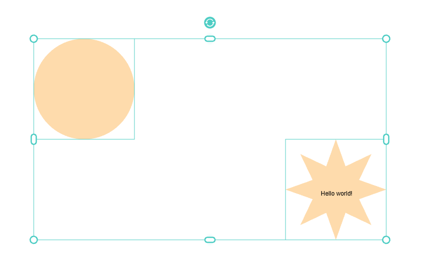

# pixi-essentials-transformer-extended

Modern Canva-style transformer for PixiJS with beautiful interactive handles for scaling, rotating, and transforming display-objects.

This is an enhanced version of `@pixi-essentials/transformer` with modern UI improvements inspired by Canva, featuring configurable rotator anchor lines and advanced styling options.

<p align="center">

</p>

## Installation :package:

```bash
npm install pixi-essentials-transformer-extended
```

**Original package:** [@pixi-essentials/transformer](https://www.npmjs.com/package/@pixi-essentials/transformer) by Shukant K. Pal

## Pens :pen:

- Standard usage: https://codepen.io/sukantpal/pen/dyMMmZm
- Usage with @pixi-essentials/react-bindings: https://codepen.io/sukantpal/pen/ZEWWoWX

## Transform options :page_with_curl:

| Property           | Default | Description                                                                                                                  |
| ------------------ | ------- | ---------------------------------------------------------------------------------------------------------------------------- |
| boxRotationEnabled | false   | Rotation by dragging near outside the four corners of the bounding box                                                       |
| boxScalingEnabled  | false   | Scaling by dragging the edges of the bounding-box (also called the wireframe)                                                |
| centeredScaling    | false   | Whether scaling object should keep its center invariant (instead of the side being dragged)                                  |
| rotateEnabled      | true    | Enables the rotator handle above the top-edge of the wireframe                                                               |
| scaleEnabled       | true    | Enables the 8 scaling handles (topLeft, topCenter, topRight, middleLeft, middleRight, bottomLeft, bottomCenter, bottomRight) |
| skewEnabled        | false   | Enables the 2 skewing handles                                                                                                |
| translateEnabled   | true    | Enables translation by dragging the wireframe. The transformer will capture all mouse events in the group's bounds           |

## 🎨 Modern Canva-Style Transformer

The transformer now features a modern, Canva-inspired design with:

- ⭕ **Circle handles** for corners
- 💊 **Pill-shaped handles** for edges (top, bottom, left, right)
- 🔄 **Custom rotation icon** with curved arrows
- ✨ **Subtle glow effects** for better visibility
- 🎯 **Clean design** with white fills and colored borders
- 📏 **Configurable rotator anchor line** connecting bounding box to rotator handle

### Basic Usage

```typescript
const transformer = new PIXI.Transformer({
  group: [sprite1, sprite2],
  stage: app.stage,
  transientGroupTilt: false, // Important for rotation to work properly

  // Modern handle style (these are the defaults)
  handleStyle: {
    radius: 7,
    color: 0xffffff, // White fill
    outlineColor: 0x6366f1, // Indigo border
    outlineThickness: 2.5,
    glowColor: 0x6366f1,
    glowIntensity: 0.15,
  },

  // Clean wireframe (these are the defaults)
  wireframeStyle: {
    color: 0x6366f1, // Indigo color
    thickness: 2, // Thin border
  },

  // Color theme configuration
  colorTheme: {
    primary: 0x6366f1, // Main color for handles and wireframe
    secondary: 0x4f46e5, // Secondary accent color
    background: 0xffffff, // Handle background
    glow: 0x6366f1, // Glow effect color
    glowIntensity: 0.15, // Glow intensity (0-1)
  },

  // Rotator anchor line configuration
  rotatorAnchor: {
    enabled: true, // Show/hide the anchor line
    startPosition: 0.45, // Start position (0-1, 0.45 = 45% from bounding box)
    segmentLength: 0.005, // Line length (0-1, 0.005 = 0.5% of total distance)
    thickness: 2, // Line thickness (uses wireframe thickness if undefined)
    color: 0x6366f1, // Line color (uses theme color if undefined)
    style: "solid", // 'solid' | 'dashed' | 'dotted'
    dashPattern: [8, 4], // [dashLength, gapLength] for dashed style
    dotPattern: [2, 4], // [dotSize, gapLength] for dotted style
  },
});
```

## 🎯 Rotator Anchor Configuration

The rotator anchor line is a configurable visual element that connects the bounding box to the rotator handle. It can be customized in real-time:

### Dynamic Configuration

```typescript
// Enable/disable the anchor line
transformer.rotatorAnchor = { enabled: false };

// Change to dashed style with custom pattern
transformer.rotatorAnchor = {
  style: "dashed",
  dashPattern: [10, 5], // 10px dashes, 5px gaps
  startPosition: 0.5, // Start at 50% from bounding box
};

// Change to dotted style with custom dots
transformer.rotatorAnchor = {
  style: "dotted",
  dotPattern: [3, 6], // 3px dots, 6px gaps
  segmentLength: 0.02, // Longer line segment
};

// Position closer to bounding box
transformer.rotatorAnchor = { startPosition: 0.2 };

// Position farther from bounding box
transformer.rotatorAnchor = { startPosition: 0.7 };
```

### Color Theme System

```typescript
// Change entire color theme
transformer.colorTheme = {
  primary: 0xff6b6b, // Red theme
  secondary: 0xe74c3c,
  glow: 0xff6b6b,
  glowIntensity: 0.2,
};

// All handles and wireframe automatically update
// Rotator anchor uses theme color unless overridden
```

## Usage :page_facing_up:

```js
import * as PIXI from "pixi.js";
import { Transformer } from "pixi-essentials-transformer-extended";

const app = new PIXI.Application({
  resolution: window.devicePixelRatio,
  autoDensity: true,
  backgroundColor: 0xabcdef,
  width: 1024,
  height: 1024,
  antialias: true,
});

document.body.appendChild(app.view);

const circle = app.stage.addChild(new PIXI.Graphics());

circle.beginFill(0xfedbac).drawCircle(0, 0, 100).endFill();
circle.pivot.set(50, 100);
circle.scale.set(1);
circle.position.set(300, 300);

const star = app.stage.addChild(new PIXI.Graphics());

star.beginFill(0xfedbac).drawStar(0, 0, 8, 100).endFill();
star.position.set(800, 500);
star.pivot.set(50, 100);

app.stage.addChild(
  new Transformer({
    group: [circle, star],
  })
);
```

## 🚀 New Features

### Enhanced Handle Design

- **Modern Canva-style handles** with white fills and colored borders
- **Pill-shaped edge handles** for better ergonomics
- **Professional rotation icon** with curved double-arrow design
- **Subtle glow effects** for improved visibility and modern feel

### Configurable Rotator Anchor

- **Three line styles**: Solid, dashed, and dotted
- **Customizable positioning** with percentage-based control
- **Pattern customization** for dash and dot styles
- **Real-time updates** with instant visual feedback

### Dynamic Color Theming

- **Complete color system** affecting handles, wireframe, and anchor
- **Runtime theme switching** without recreation
- **Consistent color application** across all elements
- **Glow intensity control** for subtle visual effects

### TypeScript Support

- **Full type definitions** for all configuration options
- **IntelliSense support** for better development experience
- **Type-safe configuration** preventing runtime errors

### Intelligent Scaling System

- **Proportional scaling** for all handle elements (SVG icons, pill handles, glow effects)
- **Dynamic rotator positioning** that maintains proper spacing with larger handles
- **Scalable SVG icons** that remain crisp at any size
- **Adaptive rotator anchor** positioning that adjusts based on handle size
- **Consistent visual balance** across all scale factors

## 📏 Handle Size Scaling

The transformer intelligently scales all elements when you increase handle sizes:

### Scaling Behavior

```typescript
// Example: 200% larger handles
const transformer = new PIXI.Transformer({
  handleStyle: {
    radius: 14, // 200% of default 7px
    outlineThickness: 5, // Scales proportionally
    glowIntensity: 0.35, // Enhanced for larger handles
  },
  wireframeStyle: {
    thickness: 4, // Scales with handle size
  },
  rotatorAnchor: {
    thickness: 4, // Maintains visual balance
    segmentLength: 0.012, // Slightly longer for larger handles
  },
});
```

### What Scales Automatically

| Element                  | Scaling Behavior                                             |
| ------------------------ | ------------------------------------------------------------ |
| **SVG Rotator Icon**     | Scales proportionally with handle radius                     |
| **Pill Handles**         | Width/height scale with radius (maintains aspect ratio)      |
| **Glow Effects**         | Offset and intensity scale with handle size                  |
| **Rotator Distance**     | Position scales to maintain proper spacing from bounding box |
| **Anchor Line Position** | Adjusts start position based on handle size                  |

### Size Presets

```typescript
// Small (Default) - 7px radius
handleStyle: { radius: 7, outlineThickness: 2.5, glowIntensity: 0.15 }

// Medium (150%) - 10px radius
handleStyle: { radius: 10, outlineThickness: 3.5, glowIntensity: 0.25 }

// Large (200%) - 14px radius
handleStyle: { radius: 14, outlineThickness: 5, glowIntensity: 0.35 }

// Extra Large (300%) - 21px radius
handleStyle: { radius: 21, outlineThickness: 7.5, glowIntensity: 0.5 }
```

### Real-time Scaling

All scaling happens in real-time without recreating the transformer:

```typescript
// Dynamically increase handle size
transformer.handleStyle = {
  radius: 33, // Large handles
  outlineThickness: 10.5,
  glowIntensity: 0.5,
};

// Rotator anchor automatically adjusts
transformer.rotatorAnchor = {
  thickness: 9, // Proportional to wireframe
  segmentLength: 0.024, // Longer for larger handles
};
```

## External Resources

- (Initial release) [Vector rendering of SVG content with PixiJS](https://medium.com/javascript-in-plain-english/vector-rendering-of-svg-content-with-pixijs-6f26c91f09ee?source=friends_link&sk=1faf7f354ab39bd79d476bf33e9d44d1)
